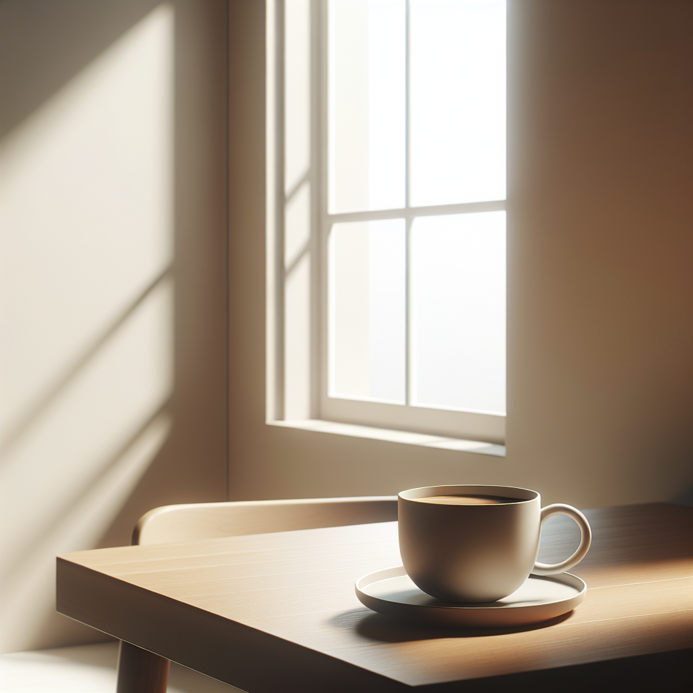
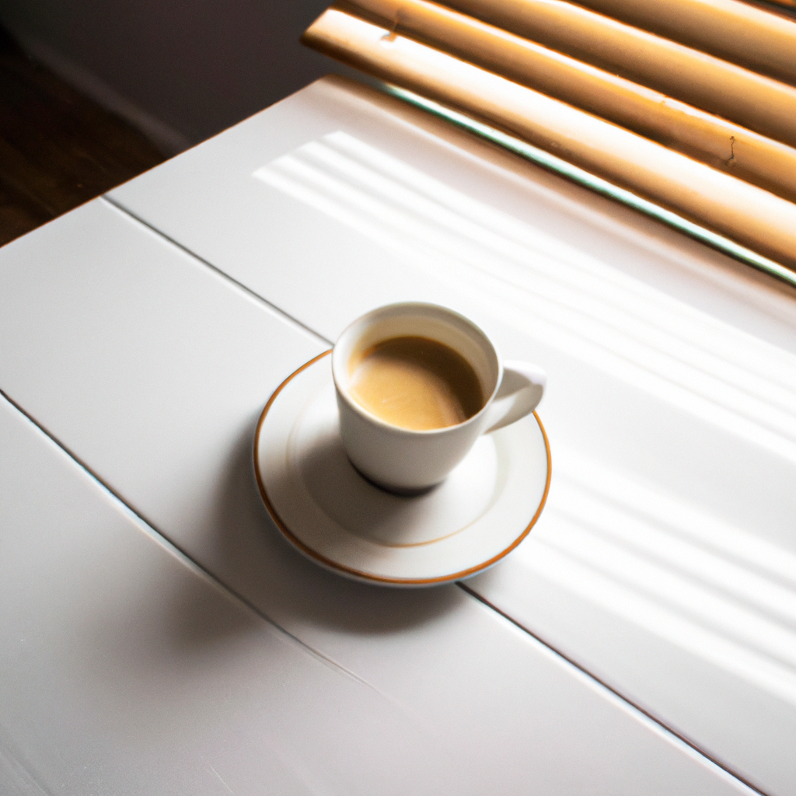

Masscer allows you to create stunning images using advanced generation models like **DALL·E** by OpenAI and the powerful **FLUX** models by Black Forest Labs. Whether you need creative illustrations, visual concepts for projects, or any type of graphic content, Masscer provides the tools to bring your ideas to life.

## What can you do with image generation in Masscer?

With the image-generation models in Masscer, you can:

- **Create images from text**: Convert detailed descriptions into high-quality images. For example, a prompt like *"A cat astronaut walking on the moon"* will generate an image that matches that description.
- **Select aspect ratios**: Customize the aspect ratio of your images to fit your needs, whether for social media, presentations, or specific projects.
- **Explore creativity and diversity**: Generate multiple images with a single prompt and select the one that best fits your vision.
- **Use advanced models**:
  - **DALL·E 3 and 2** by OpenAI: Models specialized in generating detailed and accurate images.
  - **FLUX1.1 [pro], FLUX.1 [pro], and FLUX.1 [dev]** by Black Forest Labs: State-of-the-art models with high visual quality, diversity, and prompt adherence.

---

## How to generate images in Masscer?

Generating images in Masscer is a simple and intuitive process. Follow these steps to get started:

1. **Access the image generation option**:
   - In the chat panel, scroll the sidebar until you find the **"Generate Images"** option.
   - Click on this option to open the image-generation window.

2. **Enter your prompt**:
   - Provide a detailed description of the image you want to create. For example: *"A futuristic city at sunset with flying cars and glass skyscrapers."*

3. **Select the aspect ratio**:
   - Choose the aspect ratio you prefer for your image (e.g., 16:9, 1:1, 4:3, etc.). This allows you to customize the format of the image to suit your needs.

4. **Generate the image**:
   - Click the **"Generate"** button. The models will process your prompt and generate one or more images based on your description.

5. **Explore and select**:
   - Review the generated images and select the one that best fits your vision. You can save the image or use it directly in your project.

---

## Available models for image generation

### **DALL·E 3**
DALL·E 3 is OpenAI's most advanced model for generating images from text. This model excels at interpreting detailed descriptions and transforming them into visually stunning images with unparalleled precision. Thanks to its ability to handle complex prompts, DALL·E 3 is ideal for projects requiring multiple visual elements, such as creative illustrations, character design, detailed visual concepts, or even abstract artistic representations. Additionally, its capability to generate accurate textures, shadows, and colors makes it a powerful tool for artists, designers, and content creators.

---

### **DALL·E 2**
Although it is a previous version of DALL·E, it remains an extremely efficient and versatile option for generating original images from text. DALL·E 2 combines creativity and flexibility, allowing users to obtain attractive images even with less detailed descriptions. It is perfect for projects that need a balance between speed and quality, such as social media content, quick visual prototypes, or design tests. Its ability to explore abstract and stylized visual concepts makes it an excellent tool for those looking to experiment with innovative ideas or develop unique visual drafts.

---

### **FLUX1.1 [pro]**
FLUX1.1 [pro] is the flagship model of Black Forest Labs, designed to deliver state-of-the-art image generation quality. This model combines exceptional visual fidelity, precise details, and a wide diversity of results, making it ideal for demanding commercial applications. Whether you need to generate images for advertising, graphic design, branding, or high-impact projects, FLUX1.1 [pro] guarantees results that exceed expectations. Additionally, being available via API and platforms like freepik and Replicate allows for seamless integration into enterprise workflows. Its power and flexibility make it an indispensable tool for design and creativity professionals.

![Image generated by FLUX1.1 [pro]](../../../assets/images/flux1.1-pro.png)

---

### **FLUX.1 [pro]**
FLUX.1 [pro] is an optimized version for speed, designed for users who need quick results without sacrificing quality. This model excels in generating images with strong prompt adherence, maintaining high visual quality and diversity of results. It is ideal for projects that require rapid iterations, such as creating visual content for social media, conceptual design, or prototype development. Its accessibility through API and platforms like together.ai makes it a convenient choice for creators looking for a balance between efficiency and quality.

![Image generated by FLUX.1 [pro]](../../../assets/images/flux1-pro.png)

---

### **FLUX.1 [dev]**
FLUX.1 [dev] is an open-weight model derived from FLUX.1 [pro], specifically designed for non-commercial applications. This model offers visual quality comparable to its professional counterpart, but with greater processing efficiency, making it ideal for educational projects, academic research, and personal creative exploration. Being available on platforms like HuggingFace, Replicate, and fal.ai, FLUX.1 [dev] is an excellent choice for those looking to experiment with advanced tools without compromising access or functionality.

![Image generated by FLUX.1 [dev]](../../../assets/images/flux1-dev.png)

---

## Tips for best results

- **Be specific with your prompt**: Include as many details as possible. For example, instead of writing *"A dog"*, write *"A golden retriever playing in a field of flowers at sunrise."*
- **Experiment with the aspect ratio**: Try different proportions to adapt the images to your specific needs.
- **Generate multiple versions**: Some models, like **FLUX1.1 [pro]**, offer a high diversity of results. Generating multiple images will allow you to explore different options.

