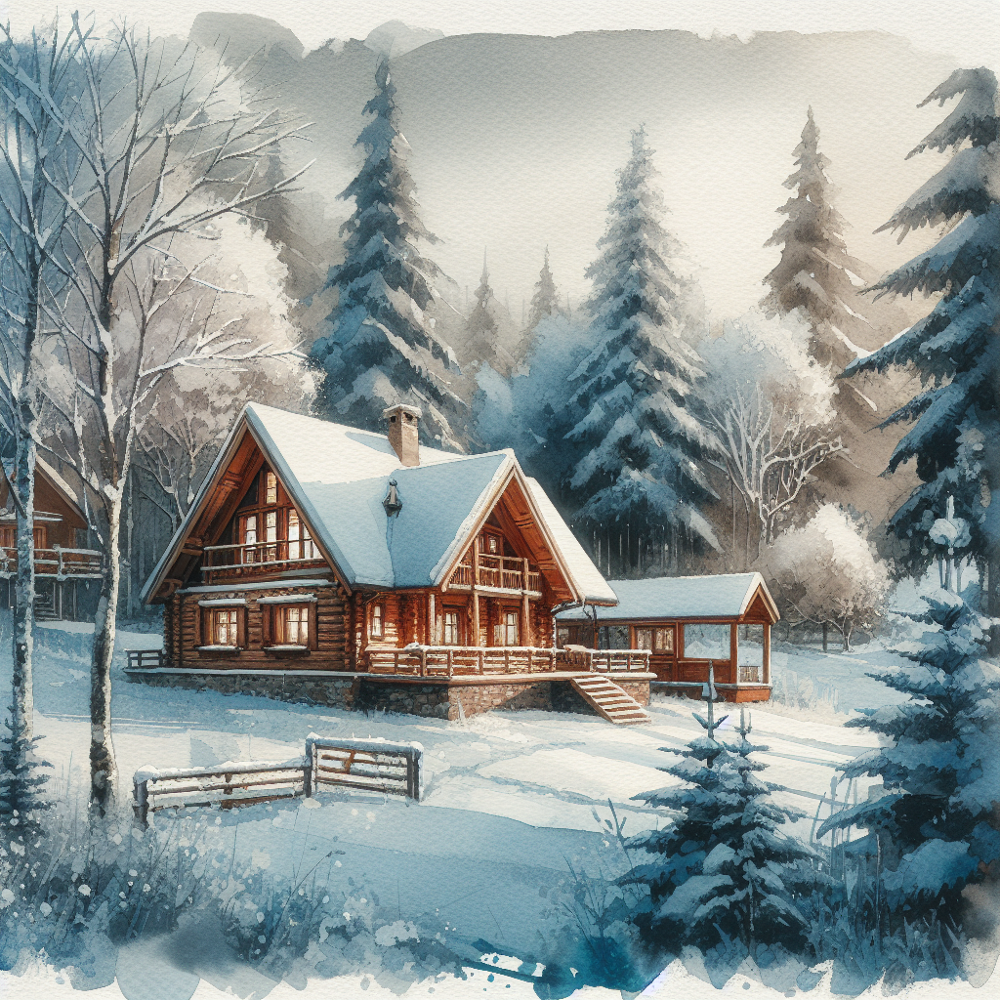

Prompts are the foundation for effectively interacting with AI models. A well-crafted prompt can dramatically improve the quality of outputs generated by AI, whether it's text, images, videos, or other creative tasks. This guide will help you understand what prompts are, why they matter, and how to write effective prompts for various applications.

---

## What is a Prompt and Why is it Important?

A **prompt** is the input or instruction you provide to an AI model to guide its output. It can be a question, a description, or a set of instructions that tell the model what you want it to generate or solve.

The importance of prompts lies in their ability to influence the performance of the AI. A well-crafted prompt provides context, clarity, and specificity, leading to more accurate and relevant results. On the other hand, a vague or poorly written prompt can produce low-quality or off-topic outputs.

### Key aspects of a good prompt:
- **Clarity**: Instructions should be clear and unambiguous.
- **Specificity**: Provide enough detail to minimize the model's uncertainty.
- **Context**: Include relevant information to guide the AI.
- **Conciseness**: Avoid unnecessary words or overly complex instructions.

---

## How to Write a Prompt for Text Generation

Text generation models, such as GPT, excel at producing coherent and contextually appropriate text. Writing a good prompt for text generation requires understanding the task and structuring your input effectively.

### Steps to Craft a Text Generation Prompt:
1. **Define the Task**: Clearly state what you want the model to do (e.g., write an article, summarize a document, or answer a question).
2. **Provide Context**: Include any necessary background information or examples.
3. **Set the Tone**: Specify the style, tone, or format you want (e.g., formal, casual, persuasive).
4. **Ask Specific Questions**: Use direct and specific instructions to guide the output.

#### Example Prompts:
- **Article Writing**: "Write a 500-word article about the benefits of renewable energy. Use a formal tone and include at least three key examples."
- **Summarization**: "Summarize the following text in one paragraph: [Insert text here]."
- **Q&A**: "What are the main advantages of using solar energy?"

---

## How to Write a Prompt for Image Generation

Image generation models, such as DALL·E and Flux, rely on descriptive prompts to create visuals. A good image prompt involves specifying the elements of the image, such as style, objects, colors, and composition.

### Tips for Writing Image Prompts:
1. **Be Descriptive**: Clearly describe what you want to see in the image.
2. **Include Style and Mood**: Mention artistic styles (e.g., watercolor, 3D render, anime) or emotions (e.g., serene, dramatic).
3. **Specify Details**: Include key attributes like colors, lighting, and perspective.
4. **Iterate and Refine**: Test and adjust your prompt based on the results.

#### Example Prompts:

##### Flux1.1
- "A futuristic urban landscape at sunset, with neon lights reflecting on wet streets. Style: cyberpunk, highly detailed, 4K resolution."

##### DALL·E 3
- "A cozy cabin in the woods during winter, surrounded by snow-covered trees. Style: watercolor painting, warm and inviting."

---

## How to Write a Prompt for Video Generation

Video generation models, while still emerging, can create short clips or animations based on prompts. Writing prompts for video generation requires a mix of storytelling and visual description.

### Steps to Craft a Video Prompt:
1. **Describe the Scene**: Define the setting, characters, and actions.
2. **Specify the Style**: Mention whether the video should be realistic, animated, cinematic, etc.
3. **Include Timing**: Indicate the duration or key moments in the video.
4. **Focus on Key Details**: Highlight essential elements like colors, lighting, or camera angles.

#### Example Prompts:
- "A 10-second video of a spaceship landing on a distant planet. The planet has a red, rocky surface with two suns in the sky. Cinematic style, with dramatic lighting and lens flares."
- "A short animation of a cat chasing a butterfly in a magical forest. The forest glows with bioluminescent plants, and the mood is whimsical and joyful."

---

## General Tips for Crafting Effective Prompts

Regardless of the type of content you're generating (text, images, or videos), these general tips will help you create better prompts:

1. **Experiment and Iterate**: AI models often respond better after testing and refining multiple versions of a prompt.
2. **Use Examples**: Providing examples can help the model understand the desired format or style.
3. **Be Explicit**: Avoid vague language; specify exactly what you want.
4. **Leverage AI's Strengths**: Understand the strengths and limitations of the model you're using, and tailor your prompts accordingly.
5. **Add Constraints**: If needed, set boundaries for the output (e.g., word count, style, or specific topics to avoid).

---

## Further Reading

- Learn more about prompts and prompt engineering in AI:
  - [Prompt Engineering Guide](https://www.promptingguide.ai)
  - [OpenAI's Best Practices for Prompting](https://platform.openai.com/docs/guides/completion/best-practices)
  - [MidJourney Prompt Writing Tips](https://midjourney.com/prompt-guide/)
