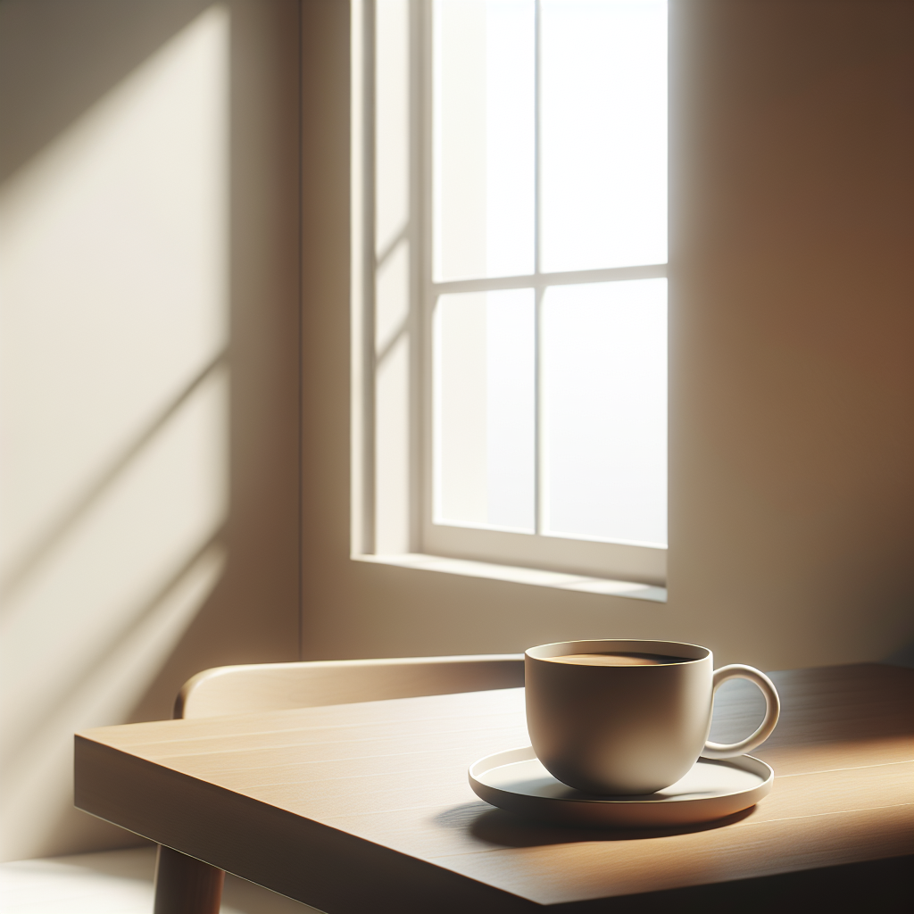
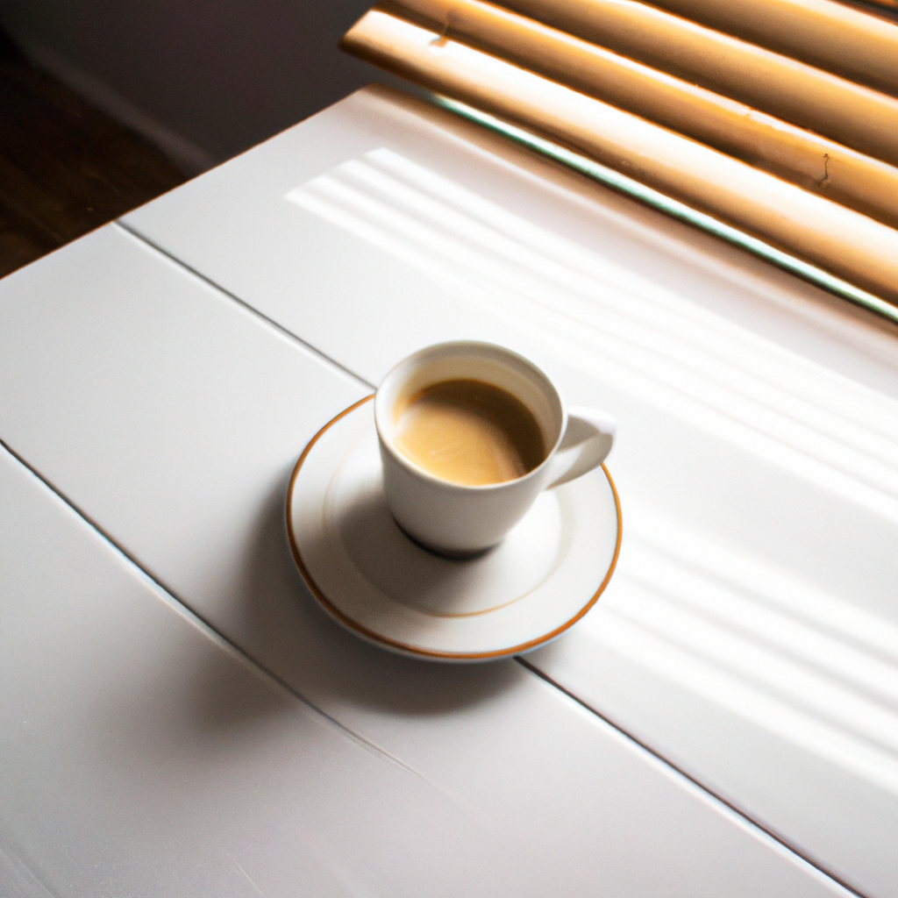

Masscer te permite crear imágenes impresionantes utilizando modelos avanzados de generación como **DALL·E** de OpenAI y los potentes modelos **FLUX** de Black Forest Labs. Ya sea que necesites ilustraciones creativas, conceptos visuales para proyectos o cualquier tipo de contenido gráfico, Masscer tiene las herramientas necesarias para dar vida a tus ideas.

## ¿Qué puedes hacer con la generación de imágenes en Masscer?

Con los modelos de generación de imágenes en Masscer, puedes:

- **Crear imágenes a partir de texto**: Convierte descripciones detalladas en imágenes de alta calidad. Por ejemplo, un prompt como *"Un gato astronauta caminando en la luna"* generará una imagen que coincida con esa descripción.
- **Seleccionar proporciones (aspect ratios)**: Personaliza la relación de aspecto de tus imágenes para adaptarlas a tus necesidades, ya sea para redes sociales, presentaciones o proyectos específicos.
- **Explorar creatividad y diversidad**: Genera múltiples imágenes con un solo prompt y selecciona la que mejor se ajuste a tu visión.
- **Usar modelos avanzados**:
  - **DALL·E 3 y 2** de OpenAI: Modelos especializados en generar imágenes detalladas y precisas.
  - **FLUX1.1 [pro], FLUX.1 [pro] y FLUX.1 [dev]** de Black Forest Labs: Modelos de última generación con alta calidad visual, diversidad y adherencia a prompts.

---

## ¿Cómo generar imágenes en Masscer?

Generar imágenes en Masscer es un proceso simple e intuitivo. Sigue estos pasos para empezar:

1. **Accede a la opción de generación de imágenes**:
   - En el panel del chat, desplaza la barra lateral hasta encontrar la opción **"Generar Imágenes"**.
   - Haz clic en esta opción para abrir la ventana de generación de imágenes.

2. **Escribe tu prompt**:
   - Ingresa una descripción detallada de la imagen que deseas crear. Por ejemplo: *"Una ciudad futurista al atardecer con automóviles voladores y rascacielos de cristal."*

3. **Selecciona el aspect ratio (proporción de aspecto)**:
   - Elige la relación de aspecto que prefieras para tu imagen (por ejemplo, 16:9, 1:1, 4:3, etc.). Esto te permitirá personalizar el formato de la imagen según tus necesidades.

4. **Genera la imagen**:
   - Haz clic en el botón **"Generar"**. Los modelos procesarán tu prompt y generarán una o varias imágenes basadas en tu descripción.

5. **Explora y selecciona**:
   - Revisa las imágenes generadas y selecciona la que mejor se ajuste a tu visión. Puedes guardar la imagen o utilizarla directamente en tu proyecto.

---

## Modelos disponibles para generación de imágenes

### **DALL·E 3**
DALL·E 3 es el modelo más avanzado de OpenAI para generar imágenes a partir de texto. Este modelo destaca por su capacidad para interpretar descripciones detalladas y convertirlas en imágenes visualmente impresionantes con un nivel de precisión difícil de igualar. Gracias a su capacidad para manejar prompts complejos, DALL·E 3 es ideal para proyectos que requieren múltiples elementos visuales, como ilustraciones creativas, diseño de personajes, conceptos visuales detallados o incluso representaciones artísticas abstractas. Además, su capacidad para generar texturas, sombras y colores precisos lo convierte en una herramienta poderosa para artistas, diseñadores y creadores de contenido.

---

### **DALL·E 2**
Aunque es una versión anterior de DALL·E, sigue siendo una opción extremadamente eficiente y versátil para generar imágenes originales a partir de texto. DALL·E 2 combina creatividad y flexibilidad, permitiendo a los usuarios obtener imágenes atractivas incluso con descripciones menos detalladas. Es perfecto para proyectos que necesitan un balance entre velocidad y calidad, como contenido para redes sociales, prototipos visuales rápidos o pruebas de diseño. Su capacidad para explorar conceptos visuales abstractos y estilizados lo convierte en una excelente herramienta para quienes buscan experimentar con ideas innovadoras o desarrollar bocetos visuales únicos.

---

### **FLUX1.1 [pro]**
FLUX1.1 [pro] es el modelo insignia de Black Forest Labs, diseñado para ofrecer una calidad de generación de imágenes de última generación. Este modelo combina fidelidad visual excepcional, detalles precisos y una amplia diversidad en los resultados, lo que lo hace ideal para aplicaciones comerciales exigentes. Ya sea que necesites generar imágenes para publicidad, diseño gráfico, branding o proyectos de alto impacto, FLUX1.1 [pro] garantiza resultados que superan las expectativas. Además, al estar disponible en API y plataformas como freepik y Replicate, permite una integración fluida con flujos de trabajo empresariales. Su potencia y flexibilidad lo convierten en una herramienta indispensable para profesionales del diseño y la creatividad.

![Imagen generada por FLUX1.1 [pro]](../../../../assets/images/flux1.1-pro.png)

---

### **FLUX.1 [pro]**
FLUX.1 [pro] es una versión optimizada para velocidad, diseñada para usuarios que necesitan resultados rápidos sin sacrificar la calidad. Este modelo sobresale en la generación de imágenes con gran adherencia a los prompts, manteniendo una alta calidad visual y diversidad en los resultados. Es ideal para proyectos que requieren iteraciones rápidas, como la creación de contenido visual para redes sociales, diseño conceptual o desarrollo de prototipos. Su accesibilidad a través de API y plataformas como together.ai lo convierte en una opción conveniente para creadores que buscan un balance entre eficiencia y calidad.

![Imagen generada por FLUX.1 [pro]](../../../../assets/images/flux1-pro.png)

---

### **FLUX.1 [dev]**
FLUX.1 [dev] es un modelo de código abierto derivado de FLUX.1 [pro], diseñado específicamente para aplicaciones no comerciales. Este modelo ofrece una calidad visual comparable a su contraparte profesional, pero con mayor eficiencia en el procesamiento, lo que lo hace ideal para proyectos educativos, investigación académica y exploración creativa personal. Al estar disponible en plataformas como HuggingFace, Replicate y fal.ai, FLUX.1 [dev] es una excelente opción para quienes buscan experimentar con herramientas avanzadas sin comprometer el acceso o la funcionalidad.

![Imagen generada por FLUX.1 [dev]](../../../../assets/images/flux1-dev.png)

---

## Consejos para obtener los mejores resultados

- **Sé específico con tu prompt**: Incluye tantos detalles como sea posible. Por ejemplo, en lugar de escribir *"Un perro"*, escribe *"Un perro golden retriever jugando en un campo de flores al amanecer"*.
- **Experimenta con el aspect ratio**: Prueba diferentes proporciones para adaptar las imágenes a tus necesidades específicas.
- **Genera múltiples versiones**: Algunos modelos como **FLUX1.1 [pro]** ofrecen una alta diversidad en los resultados. Generar varias imágenes te permitirá explorar diferentes opciones.

