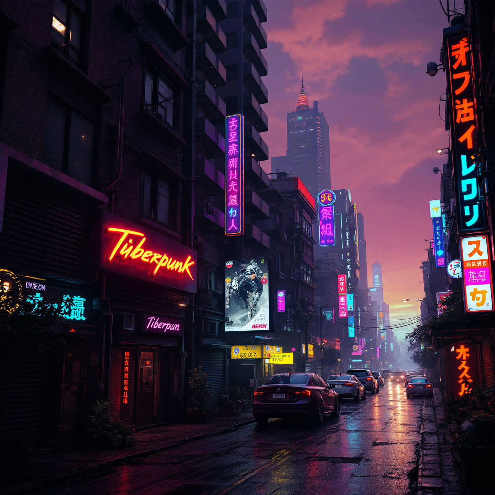

Los prompts son la base para interactuar de manera efectiva con los modelos de inteligencia artificial. Un prompt bien diseñado puede mejorar drásticamente la calidad de los resultados generados por la IA, ya sea texto, imágenes, videos u otras tareas creativas. Esta guía te ayudará a entender qué son los prompts, por qué son importantes y cómo escribir prompts efectivos para diversas aplicaciones.

---

## ¿Qué es un Prompt y por qué es importante?

Un **prompt** es la entrada o instrucción que le proporcionas a un modelo de IA para guiar su salida. Puede ser una pregunta, una descripción o un conjunto de instrucciones que le indique al modelo lo que deseas que genere o resuelva.

La importancia de los prompts radica en su capacidad para influir en el rendimiento de la IA. Un prompt bien diseñado proporciona contexto, claridad y especificidad, lo que lleva a resultados más precisos y relevantes. Por otro lado, un prompt vago o mal redactado puede generar resultados de baja calidad o fuera de contexto.

### Aspectos clave de un buen prompt:
- **Claridad**: Las instrucciones deben ser claras y sin ambigüedades.
- **Especificidad**: Proporciona suficientes detalles para minimizar la incertidumbre del modelo.
- **Contexto**: Incluye información relevante para orientar a la IA.
- **Concisión**: Evita palabras innecesarias o instrucciones demasiado complejas.

---

## Cómo escribir un prompt para generación de texto

Los modelos de generación de texto, como GPT, son excelentes para producir texto coherente y contextual. Escribir un buen prompt para generación de texto requiere entender la tarea y estructurar tu entrada de manera efectiva.

### Pasos para redactar un prompt de texto:
1. **Define la tarea**: Explica claramente lo que quieres que haga el modelo (por ejemplo, escribir un artículo, resumir un documento o responder una pregunta).
2. **Proporciona contexto**: Incluye cualquier información de fondo o ejemplos necesarios.
3. **Establece el tono**: Indica el estilo, tono o formato que deseas (por ejemplo, formal, casual, persuasivo).
4. **Haz preguntas específicas**: Usa instrucciones directas y específicas para guiar el resultado.

#### Ejemplos de prompts:
- **Escritura de artículos**: "Escribe un artículo de 500 palabras sobre los beneficios de la energía renovable. Usa un tono formal e incluye al menos tres ejemplos clave."
- **Resumen**: "Resume el siguiente texto en un párrafo: [Inserta el texto aquí]."
- **Preguntas y respuestas**: "¿Cuáles son las principales ventajas de usar energía solar?"

---

## Cómo escribir un prompt para generación de imágenes

Los modelos de generación de imágenes, como DALL·E y Flux, dependen de prompts descriptivos para crear visuales. Un buen prompt para imágenes incluye detalles sobre los elementos visuales, el estilo y la composición.

### Consejos para redactar prompts de imágenes:
1. **Sé descriptivo**: Describe claramente lo que deseas ver en la imagen.
2. **Incluye estilo y estado de ánimo**: Menciona estilos artísticos (por ejemplo, acuarela, renderizado 3D, anime) o emociones (por ejemplo, sereno, dramático).
3. **Especifica detalles**: Incluye atributos clave como colores, iluminación y perspectiva.
4. **Itera y ajusta**: Prueba y mejora tu prompt según los resultados obtenidos.

#### Ejemplos de prompts:

##### Flux1.1
- "Un paisaje urbano futurista al atardecer, con luces de neón reflejadas en calles mojadas. Estilo: ciberpunk, altamente detallado, resolución 4K."

##### DALL·E 3
- "Una cabaña acogedora en el bosque durante el invierno, rodeada de árboles cubiertos de nieve. Estilo: pintura en acuarela, cálida y acogedora."

---

## Cómo escribir un prompt para generación de videos

Los modelos de generación de videos, aunque aún en desarrollo, pueden crear clips cortos o animaciones basadas en prompts. Escribir prompts para videos requiere una combinación de narrativa y descripción visual.

### Pasos para redactar un prompt de video:
1. **Describe la escena**: Define el escenario, los personajes y las acciones.
2. **Especifica el estilo**: Menciona si el video debe ser realista, animado, cinematográfico, etc.
3. **Incluye el tiempo**: Indica la duración o los momentos clave del video.
4. **Enfócate en los detalles clave**: Destaca elementos esenciales como colores, iluminación o ángulos de cámara.

#### Ejemplos de prompts:
- "Un video de 10 segundos de una nave espacial aterrizando en un planeta distante. El planeta tiene una superficie roja y rocosa con dos soles en el cielo. Estilo cinematográfico, con iluminación dramática y destellos de lente."
- "Una animación corta de un gato persiguiendo a una mariposa en un bosque mágico. El bosque brilla con plantas bioluminiscentes, y el ambiente es alegre y encantador."

---

## Consejos generales para redactar prompts efectivos

Independientemente del tipo de contenido que estés generando (texto, imágenes o videos), estos consejos generales te ayudarán a crear mejores prompts:

1. **Experimenta e itera**: Los modelos de IA suelen responder mejor después de probar y ajustar múltiples versiones de un prompt.
2. **Usa ejemplos**: Proporcionar ejemplos puede ayudar al modelo a entender el formato o estilo deseado.
3. **Sé explícito**: Evita un lenguaje vago; especifica exactamente lo que deseas.
4. **Aprovecha las fortalezas de la IA**: Conoce las capacidades y limitaciones del modelo que estás utilizando, y adapta tus prompts en consecuencia.
5. **Añade restricciones**: Si es necesario, establece límites para el resultado (por ejemplo, número de palabras, estilo o temas a evitar).

---

## Lectura adicional

- Aprende más sobre los prompts y el diseño de prompts en IA:
  - [Guía de ingeniería de prompts](https://www.promptingguide.ai)
  - [Mejores prácticas para prompts de OpenAI](https://platform.openai.com/docs/guides/completion/best-practices)
  - [Consejos para escribir prompts en MidJourney](https://midjourney.com/prompt-guide/)
